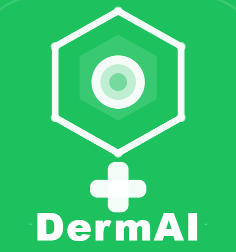

# 🔬 DermAI — AI-Powered Skin Disease Diagnosis App

<p align="center">
  
</p>

<p align="center">
  <b>Diagnose skin conditions instantly using on-device AI — with skincare routines, home remedies, and nearby doctor finder.</b>
</p>

<p align="center">
  
  
  
  
  
</p>

---

## 📱 Screenshots

> _Add screenshots here after building the release APK_

| Diagnose | Result | Skincare | Remedies | Profile |
|----------|--------|----------|----------|---------|
| _(screenshot)_ | _(screenshot)_ | _(screenshot)_ | _(screenshot)_ | _(screenshot)_ |

---

## 🌟 Features

### 🔬 AI Skin Diagnosis
- Upload or capture a photo of any skin condition
- On-device TFLite model (ResNet-50) classifies the condition in seconds
- Detects 5 conditions: **Acne & Rosacea**, **Eczema**, **Melanoma/Moles**, **Nail Fungus**, **Psoriasis**
- Confidence percentage bar with colour-coded accuracy indicator
- "What this means" explanation for each diagnosis

### 🌿 Skincare Guide
- **Morning & Night routines** — interactive checklist with timer badges
- **Disease-specific tips** — Do's and Don'ts for each detected condition
- **Ingredients guide** — what to use and what to avoid, with benefits

### 🍯 Home Remedies
- Natural remedies filtered by skin condition
- Step-by-step preparation instructions with ingredients
- Natural ingredient benefits (aloe, turmeric, honey, tea tree oil, etc.)

### 📍 Find Nearby Dermatologists
- Google Maps integration with live GPS location
- One-tap search for dermatologists and skin clinics nearby
- Opens Google Maps externally for full navigation

### 📊 Scan History
- Every diagnosis saved to Firestore under your account
- Swipe to delete individual records
- Confidence bar and time-ago display for each scan

### 🔗 Smart Deep Linking
- After diagnosis, tap "Skincare Tips" or "Home Remedies" to jump directly to the relevant disease filter
- Seamless navigation between all features

### 👤 Profile
- Google Sign-In and Email/Password authentication
- Edit display name
- Help & FAQ, Privacy Policy
- Secure sign out

---

## 🏗️ Tech Stack

| Layer | Technology |
|-------|-----------|
| Framework | Flutter 3.x (Dart) |
| ML Model | TensorFlow Lite (ResNet-50) |
| Authentication | Firebase Auth (Google + Email) |
| Database | Cloud Firestore |
| Maps | Google Maps Flutter |
| Location | Geolocator |
| State Management | setState + Provider |
| Image Input | image_picker |
| Deep Links | Custom global notifier pattern |

---

## 📂 Project Structure

```
lib/
├── main.dart                          # App entry point, Firebase init
├── resources.dart                     # Brand colors, form validators
├── firebase_options.dart              # Firebase config (auto-generated)
├── sign_in.dart                       # Login screen
├── sign_up.dart                       # Registration screen
├── forgot_password_page.dart          # Password reset
├── edit_profile.dart                  # Edit display name
├── demo_page.dart                     # Onboarding (3 slides)
│
├── main_pages/
│   ├── bottom_nav_bar.dart            # 4-tab navigation + deep link controller
│   ├── home.dart                      # Diagnose screen (camera/gallery)
│   ├── skincare_screen.dart           # Skincare guide (3 tabs)
│   ├── home_remedies_screen.dart      # Home remedies (2 tabs)
│   └── profile.dart                   # User profile
│
├── screens/
│   ├── result_screen.dart             # Diagnosis result + confidence bar
│   ├── scan_history_screen.dart       # Firestore scan history
│   ├── nearby_doctors_screen.dart     # Google Maps doctor finder
│   └── deep_link.dart                 # Global deep link state
│
├── services/
│   └── tflite_service.dart            # TFLite model inference
│
└── model/
    └── (model helper files)

assets/
├── model.tflite                       # TFLite ResNet-50 model
├── labels.txt                         # Disease class labels
├── icon.png                           # App icon (1024x1024)
└── icon_foreground.png                # Adaptive icon foreground
```

---

## 🚀 Getting Started

### Prerequisites

- Flutter SDK `>=3.0.0`
- Android Studio with Android SDK
- Java 21 (bundled with Android Studio)
- Firebase project
- Google Maps API key

### 1. Clone the repository

```bash
git clone https://github.com/yourusername/DermAI-Skin-Disease-Diagnosis.git
cd DermAI-Skin-Disease-Diagnosis
```

### 2. Install dependencies

```bash
flutter pub get
```

### 3. Firebase Setup

1. Create a Firebase project at [console.firebase.google.com](https://console.firebase.google.com)
2. Add an Android app with your package name (`com.example.dermai`)
3. Enable **Authentication** → Google + Email/Password
4. Enable **Firestore Database** (test mode to start)
5. Add your **SHA-1 fingerprint** to Firebase project settings:

```powershell
# Windows (Android Studio Java)
& "C:\Program Files\Android\Android Studio\jbr\bin\keytool.exe" -list -v -keystore "$env:USERPROFILE\.android\debug.keystore" -alias androiddebugkey -storepass android -keypass android
```

6. Download `google-services.json` → place at `android/app/google-services.json`

7. Run FlutterFire CLI to generate `firebase_options.dart`:

```bash
dart pub global activate flutterfire_cli
flutterfire configure
```

### 4. Google Maps API Key

1. Go to [Google Cloud Console](https://console.cloud.google.com)
2. Enable **Maps SDK for Android**
3. Create an API key and add your package name + SHA-1 restriction
4. Add to `android/app/src/main/AndroidManifest.xml`:

```xml
<meta-data
    android:name="com.google.android.geo.API_KEY"
    android:value="YOUR_MAPS_API_KEY"/>
```

### 5. TFLite Model

Place your trained model files in `assets/`:
- `assets/model.tflite` — ResNet-50 model trained on skin disease dataset
- `assets/labels.txt` — One label per line matching model output classes

### 6. Run the app

```bash
flutter clean
flutter pub get
flutter run
```

---

## 🔥 Firestore Security Rules

Before going to production, update your Firestore rules:

```javascript
rules_version = '2';
service cloud.firestore {
  match /databases/{database}/documents {
    match /users/{userId}/{document=**} {
      allow read, write: if request.auth != null
                         && request.auth.uid == userId;
    }
  }
}
```

---

## 📦 Build for Release

### 1. Create a keystore

```bash
keytool -genkey -v -keystore ~/dermai-key.jks \
  -keyAlias dermai -keyalg RSA -keysize 2048 \
  -validity 10000 -storetype JKS
```

### 2. Create `android/key.properties`

```properties
storePassword=yourpassword
keyPassword=yourpassword
keyAlias=dermai
storeFile=/Users/you/dermai-key.jks
```

> ⚠️ Never commit `key.properties` or `*.jks` to Git!

### 3. Build release bundle

```bash
flutter build appbundle --release
```

Output: `build/app/outputs/bundle/release/app-release.aab`

### 4. Build release APK (for direct sharing)

```bash
flutter build apk --release
```

Output: `build/app/outputs/flutter-apk/app-release.apk`

---

## 🌐 Distribution Options

| Platform | Cost | Link |
|----------|------|------|
| Google Play Store | $25 one-time | [play.google.com/console](https://play.google.com/console) |
| Amazon Appstore | Free | [developer.amazon.com](https://developer.amazon.com) |
| Samsung Galaxy Store | Free | [seller.samsungapps.com](https://seller.samsungapps.com) |
| Firebase App Distribution | Free | Firebase Console → App Distribution |
| Direct APK | Free | Share via Drive / WhatsApp |

---

## 🩺 Supported Skin Conditions

| Condition | Emoji | Skincare Tips | Home Remedies |
|-----------|-------|--------------|---------------|
| Acne & Rosacea | 🔴 | ✅ | ✅ |
| Eczema | 🌿 | ✅ | ✅ |
| Melanoma / Moles | ⚠️ | ✅ | ✅ |
| Nail Fungus | 💅 | ✅ | ✅ |
| Psoriasis | 🧴 | ✅ | ✅ |

---

## ⚠️ Medical Disclaimer

DermAI is a **screening tool only** with approximately 60% accuracy. It is not a substitute for professional medical advice, diagnosis, or treatment. Always consult a certified dermatologist for any skin concerns. Never ignore professional medical advice based on results from this app.

---

## 🛠️ Known Issues & TODOs

- [ ] Firebase Storage integration (currently disabled — requires Blaze plan)
- [ ] Profile photo upload
- [ ] iOS build and testing
- [ ] Push notifications for scan reminders
- [ ] Multi-language support (Telugu, Hindi)
- [ ] More disease categories in the ML model

---

## 🤝 Contributing

1. Fork the repository
2. Create a feature branch: `git checkout -b feature/my-feature`
3. Commit changes: `git commit -m 'feat: add my feature'`
4. Push: `git push origin feature/my-feature`
5. Open a Pull Request

---

## 📄 License

This project is licensed under the MIT License — see [LICENSE](LICENSE) for details.

---

## 👨‍💻 Author

Built with ❤️ using Flutter + Firebase + TensorFlow Lite.

> _"Early detection saves lives. DermAI puts a dermatologist in your pocket."_
